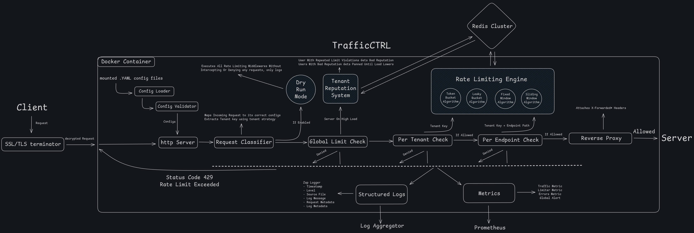
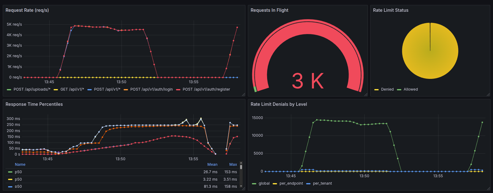
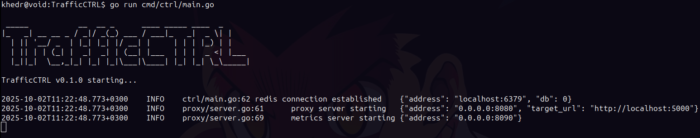

- [Overview](#overview)
- [Features](#features)
- [Benchmarks](#benchmarks)
- [Installation](#installation)
- [Configuration](#configuration)
- [Contributing](#contributing)

<br></br>

# Overview

**A lightweight reverse proxy that provides fully configurable admission control (rate limiting, throttling and access control) with complete observability features.** \
**It sits in front of your backend and filters traffic.**



### **Built With:**


_TrafficCTRL was built to fill the gap between basic, memory-bound framework middleware and overly bloated, full-featured API Gateways._

> [!IMPORTANT]
> This tool is solely focused on admission control. It does not perform SSL/TLS termination nor load balancing. It is designed to sit behind your main load balancer (like AWS ELB, Nginx, or Caddy).

<br></br>

# Features

## Rate Limiting Core

**Supports four distinct rate-limiting algorithms, fully configurable per policy and endpoint with atomic state management via Redis Lua scripts**

- **Token Bucket Algorithm**
- **Leaky Bucket Algorithm**
- **Fixed Window Counter Algorithm**
- **Sliding Window Log Algorithm**

## Layered Admission Control

**Provides three levels of security - granular, multi-layered admission control**

- **Global Limit**: works as an emergency flag, triggered when your system is on high load and it immediately activates TrafficCTRL Reputation System, banning tenants with bad reputation.

- **Per-Tenant Limit**: applies checks per individual user requests across all endpoints, ensuring fair share for resource usage.

- **Per-Endpoint Limit**: applies checks per specific endpoint/path, protecting against brute force attacks and enabling fine-grained control - different algorithms/limits/tenant strategies for different API operations

## Reputation System (Anti-Bot & Anti-Abuse)

**Tracks user behavior and assigns a Reputation to each one**

- When a tenant violates a rate limit (Endpoint or Per-Tenant), their reputation takes a hit.
- When a tenant makes a successful request, their reputation slowly recovers.
- If the proxy is under high load (Global Limit is reached), it only rejects requests from users whose score is below a threshold.
- It also applies progressive punishment, escalating penalty for abusers.

## Flexible tenant keys

**Beyond simple IP address limits. TrafficCTRL allows you to configure a unique tenant identifier**

- **HTTP Headers** (e.g., Authorization, X-User-ID).
- **Cookies**
- **Query Parameters**
- **IP Address** (Default/Fallback)

## Dry run mode

**If you’re not 100% ready to let this tool run in front of your backend and start blocking traffic, you can enable Dry Run Mode**

In this mode, TrafficCTRL will log when a request would have been rejected by your rate-limiting or admission rules — but it won’t actually block it.

This is useful for:

- Safely testing new policies on live traffic

- Verifying limiter configs without risking downtime

- Observing real-world impact before enforcing rules

_Think of it as a “simulation mode” for your proxy: you get visibility into what limits would trigger, without affecting requests._

## Observability

### Prometheus Metrics

- Full insights into requests received, latency, and concurrent requests in flight, broken down by endpoint.
- Real-time counts of allowed and, crucially, denied requests, labeled to show which layer (Global, Tenant, or Endpoint) enforced the limit.

### Structured Logs

- Uses the high-performance **Zap** logging library
- Provides configurable log levels (Trace, Debug, Info, Warn, Error, Fatal)

---

> [!NOTE]
> It follows a fail-open strategy — if Redis hiccups or any other error occurs, requests will be forwarded directly to the target URL.

<br></br>

# Benchmarks

\*The following results were generated using **k6** as the load generation tool, with metrics collected by **Prometheus** and visualized in **Grafana\***



### LOAD TEST (Production Simulation)

**Measure sustained performance under realistic production workload.** \
**Test Duration: 12 minutes with gradual ramp-up and sustained peak load.**

```shell
=============================================================================
Total Requests ......................... 10,420,087 requests
Duration ............................... 12 minutes
Throughput ............................. 14,472 RPS (Requests Per Second)
Average Latency ........................ 58ms
P95 Latency ............................ 128ms
P99 Latency ............................ 298ms
Memory Usage ........................... 166MB
```

### STRESS TEST (Maximum Capacity)

**Determine system breaking point and maximum throughput capacity**\
**Test Duration: 6 minutes with aggressive ramp-up to find system limits**

```shell
=============================================================================
Total Requests ......................... 6,250,000 requests
Duration ............................... 6 minutes
Throughput ............................. 17,361 RPS (Peak)
Average Latency ........................ 72ms
P95 Latency ............................ 156ms
P99 Latency ............................ 345ms
Maximum Concurrency .................... 3,000 virtual users
Error Rate ............................. 0% (No system failures)
Memory Usage ........................... 189MB
```

### SPIKE TEST (Traffic Burst Simulation)

**Purpose: Evaluate system behavior during sudden traffic surges** \
**Test Duration: 3 minutes with rapid burst and immediate recovery phases**

```shell
=============================================================================
Total Requests ......................... 2,100,000 requests
Duration ............................... 3 minutes
Peak Throughput ........................ 21,850 RPS (Spike)
Average Latency ........................ 123ms
P95 Latency ............................ 234ms (temporary increase during spike)
P99 Latency ............................ 512ms
Spike Handling ......................... 100 to 5,000 users in 10 seconds
Recovery Time .......................... Instant (no residual performance impact)
Memory Usage ........................... 152MB
```

> [!IMPORTANT]
> Results may vary depending on hardware, Redis deployment topology, target backend and test script behavior, these benchmarks were run with **Redis 7** colocated on the same Docker bridge network (no external latency) targeting a lightweight mock backend and with this environment:\
> CPU: Intel Core i7-10750H @ 2.60GHz (6 cores / 12 threads, turbo up to 5.0GHz)\
> Memory: 16 GB DDR4\
> OS: Ubuntu 22.04 LTS (Linux Kernel 6.14.0-32-generic)

<br></br>

# Installation



### Quick Run

---

_If you want to avoid Docker entirely, you can simply clone this repo._

```shell
git clone https://github.com/mostafa-mahmood/TrafficCTRL.git
cd TrafficCTRL
```

Then run _(requires Go 1.20+ and Redis 7+)_:

```shell
go mod tidy
go run cmd/ctrl/main.go
```

<br>

### Build Locally

---

_If you know how to use docker, u can make your own image locally and handle configurations the way you want._

```shell
git clone https://github.com/mostafa-mahmood/TrafficCTRL.git
cd TrafficCTRL
```

Edit [Dockerfile](./Dockerfile) to customize build

```shell
docker build -t ${ImageName}:${ImageTag} .
```

<br>

### Pull Prebuilt Image

---

_If you don’t want to build locally, use the prebuilt image from Docker Hub_

```shell
docker pull mmkhedr/trafficctrl:0.1.0
```

Run with docker (mounting your configs)

```shell
docker run -d \
  --name trafficctrl \
  -p 8080:8080 -p 8090:8090 \
  -v $(pwd)/config:/app/config:ro \
  mmkhedr/trafficctrl:0.1.0
```

**Exposed ports:** `8080`, `8090` \
**Config mount path:** `/app/config/`

<br></br>

# Configuration

TrafficCTRL expects four YAML configuration files in `/app/config/` (or the path you define in `CONFIG_DIR`):

- [limiter.yaml](./config/limiter.yaml) → rate limiting algorithms and rules
- [proxy.yaml](./config/proxy.yaml) → proxy target and ports
- [redis.yaml](./config/redis.yaml) → Redis connection settings
- [logger.yaml](./config/logger.yaml) → logging level and output

You can copy these files from the repo, adjust them for your own environment and mount your local configs into the container:

```shell
docker run -d \
  -p 8080:8080 -p 8090:8090 \
  -v $(pwd)/config:/app/config:ro \
  mmkhedr/trafficctrl:0.1.0
```

For simple overrides, you can skip editing YAML and just use environment variables.
**(Note: [limiter.yaml](./config/limiter.yaml) cannot be overridden with environment variables — it must be provided as YAML mounted into the container):**

| Variable                | Description                                                                              |
| ----------------------- | ---------------------------------------------------------------------------------------- |
| `TARGET_URL`            | Target backend URL                                                                       |
| `PROXY_PORT`            | Proxy listening port                                                                     |
| `METRICS_PORT`          | Metrics endpoint port                                                                    |
| `DRY_RUN_MODE`          | Run without enforcing limits (`true/false`)                                              |
| `REDIS_ADDRESS`         | Redis host:port                                                                          |
| `REDIS_PASSWORD`        | Redis password (optional)                                                                |
| `REDIS_DB`              | Redis database index                                                                     |
| `REDIS_POOL_SIZE`       | Maximum Redis connection pool size                                                       |
| `REDIS_USE_TLS`         | Use TLS for Redis (`true/false`)                                                         |
| `REDIS_TLS_SKIP_VERIFY` | Skip TLS certificate verification (`true/false`)                                         |
| `LOG_LEVEL`             | Log level (`trace`, `debug`, `info`, `warn`, `error`, `fatal`)                           |
| `LOG_ENVIRONMENT`       | Log environment (`production` / `development`)                                           |
| `LOG_OUTPUT_PATH`       | Log output file path (defaults to stdout if not set)                                     |
| `CONFIG_DIR`            | Base path to look for config files (default: /app/config/ if you use the prebuilt image) |

<br></br>

# Contributing

**This project has a long road ahead — there’s still plenty of room for new features and further polish to make it truly production-ready. I’d love your help fixing bugs, building new features, and shaping TrafficCTRL into something even stronger.**

_See [CONTRIBUTING.md](./CONTRIBUTING.md) to learn how you can jump in, and [ROADMAP.md](./ROADMAP.md) to get a peek at what’s coming down the line._

_Licensed under [MIT](./LICENSE) — free for everyone to use, hack on, and improve._

---
