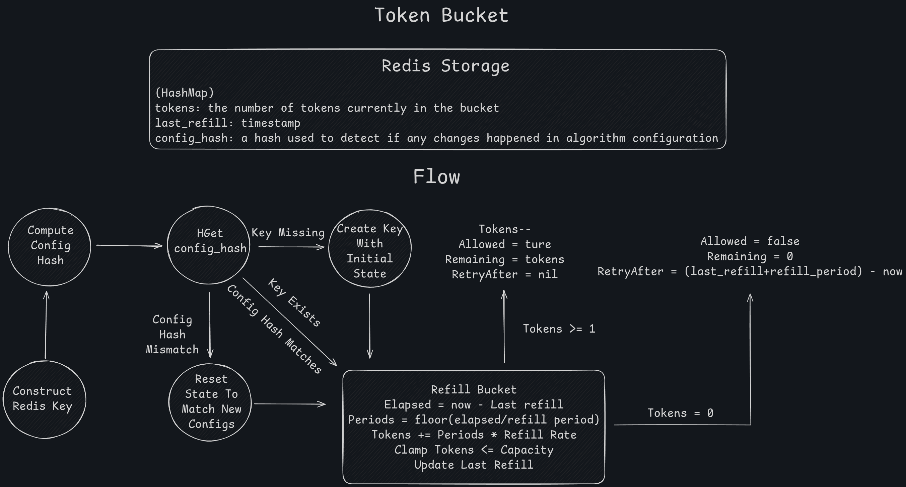
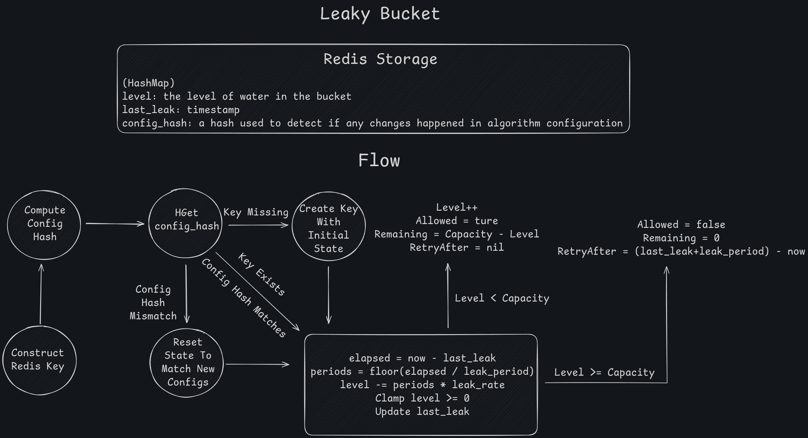

# Limiter Package Documentation

## Overview

The `limiter` package is the core rate limiting engine. It implements 4 different rate limiting algorithms using Redis Lua scripts for atomic operations, plus a reputation system for anti-bot protection.

---

## Files

### **limiter.go**

Main limiter interface and coordination logic.

**Key Types:**

```go
type RateLimiter struct {
    redisClient *redis.Client
}

type LimitResult struct {
    Allowed    bool          // Whether request is allowed
    Remaining  int64         // Remaining quota
    RetryAfter time.Duration // Time until next allowed request
}
```

**Main Functions:**

```go
func NewRateLimiter(redisClient *redis.Client) *RateLimiter
```

Factory function to create a new rate limiter instance.

```go
func (rl *RateLimiter) CheckGlobalLimit(ctx context.Context, globalConfig *config.Global) (*LimitResult, error)
```

Checks system-wide global limit. Used to detect high load and trigger reputation system.

```go
func (rl *RateLimiter) CheckTenantLimit(ctx context.Context, tenantKey string, tenantConfig *config.PerTenant) (*LimitResult, error)
```

Checks per-user limit across all endpoints.

```go
func (rl *RateLimiter) CheckEndpointLimit(ctx context.Context, tenantKey string, endpointConfig *config.EndpointRule) (*LimitResult, error)
```

Checks per-user limit for specific endpoint.

**Helper Functions:**

```go
func constructRedisKey(LevelType config.LimitLevelType, endpointPath string, endpointMethod []string, tenantKey string) string
```

Builds Redis keys based on limit level:

- Global: `ctrl:limiter:global`
- Per-Tenant: `ctrl:limiter:pertenant:{tenantKey}`
- Per-Endpoint: `ctrl:limiter:perendpoint:{methods}:{path}:{tenantKey}`

```go
func generateConfigHash(algoConfig config.AlgorithmConfig) (string, error)
```

Generates SHA256 hash of algorithm config. Used to detect config changes and reset limiters.

```go
func (rl *RateLimiter) checkLimit(ctx context.Context, redisKey string, algoConfig config.AlgorithmConfig, configHash string) (*LimitResult, error)
```

Internal dispatcher that routes to the correct algorithm implementation.

**Note:** All algorithm implementations use Lua scripts for atomicity - no race conditions even under high concurrency.

---

### **token_bucket.go**



Token bucket algorithm implementation.

**Algorithm:**

- Bucket holds tokens (capacity)
- Tokens refill at a fixed rate (refill_rate per refill_period)
- Each request consumes 1 token
- If no tokens available, request denied

**Main Function:**

```go
func (rl *RateLimiter) TokenBucketLimiter(ctx context.Context, key string, algoConfig config.AlgorithmConfig, configHash string) (*LimitResult, error)
```

**Lua Script Logic:**

1. Check if config changed (via hash) → reset bucket if changed
2. Get current bucket state (tokens, last_refill)
3. Calculate elapsed time and add tokens based on periods elapsed
4. Try to consume 1 token
5. If successful: decrement tokens, return allowed
6. If no tokens: calculate retry_after time

**Config Parameters:**

- `capacity`: Max tokens bucket can hold
- `refill_rate`: Tokens added per period
- `refill_period`: Time between refills

**Use Case:** Burst traffic with sustained rate limiting. Good for APIs that allow bursts but need to enforce average rate.

---

### **leaky_bucket.go**



Leaky bucket algorithm implementation.

**Algorithm:**

- Bucket holds requests (capacity)
- Requests leak out at fixed rate (leak_rate per leak_period)
- New requests fill the bucket
- If bucket full, request denied

**Main Function:**

```go
func (rl *RateLimiter) LeakyBucketLimiter(ctx context.Context, key string, algoConfig config.AlgorithmConfig, configHash string) (*LimitResult, error)
```

**Lua Script Logic:**

1. Check config hash → reset if changed
2. Get current bucket level and last_leak time
3. Calculate how much has leaked based on elapsed time
4. Try to add new request to bucket
5. If space available: increment level, return allowed
6. If full: calculate when next leak occurs

**Config Parameters:**

- `capacity`: Max requests bucket can hold
- `leak_rate`: Requests processed per period
- `leak_period`: Time between leak batches

**Use Case:** Smooth, constant rate processing. Good for rate limiting writes to databases or external APIs that can't handle bursts.

---

### **fixed_window.go**


Fixed window counter algorithm.

**Algorithm:**

- Time divided into fixed windows (e.g., every 60 seconds)
- Count requests in current window
- When limit reached, deny until window resets

**Main Function:**

```go
func (rl *RateLimiter) FixedWindowLimiter(ctx context.Context, key string, algoConfig config.AlgorithmConfig, configHash string) (*LimitResult, error)
```

**Lua Script Logic:**

1. Calculate current window_start (floor of now / window_size)
2. Check if window rolled over → reset count if new window
3. Check config hash → reset if changed
4. Increment counter if under limit
5. Return allowed/denied with retry_after

**Config Parameters:**

- `window_size`: Duration of each window
- `limit`: Max requests per window

**Use Case:** Simple, memory-efficient. Good for "X requests per minute" limits.

**Caveat:** Boundary problem - can get 2x requests at window edges (e.g., 100 at 0:59, 100 at 1:01 = 200 in 2 seconds).

---

### **sliding_window.go**


Sliding window log algorithm.

**Algorithm:**

- Tracks exact timestamp of each request in buckets
- Counts requests in last N milliseconds (sliding window)
- Most accurate but more memory-intensive

**Main Function:**

```go
func (rl *RateLimiter) SlidingWindowLimiter(ctx context.Context, key string, algoConfig config.AlgorithmConfig, configHash string) (*LimitResult, error)
```

**Lua Script Logic:**

1. Use 1-second buckets for granularity
2. Calculate window_start (now - window_size)
3. Check config hash → delete all buckets if changed
4. Iterate through all buckets:
   - Count requests in sliding window
   - Mark old buckets for deletion
5. Clean up old buckets
6. If under limit: increment current bucket, allow
7. If at limit: calculate when oldest request expires

**Config Parameters:**

- `window_size`: Duration of sliding window
- `limit`: Max requests in any sliding window period

**Use Case:** Most accurate rate limiting, no boundary problem. Good for strict quotas where accuracy matters.

**Trade-off:** Uses more memory (stores request timestamps), but still efficient with bucketing.

---

### **reputation.go**

Anti-bot reputation system that tracks user behavior.

**Key Type:**

```go
type Reputation struct {
    Score          float64  // 0.0 (bot) to 1.0 (good user)
    ViolationCount int64    // Total violations
    GoodRequests   int64    // Total successful requests
    TTL            int64    // Monitoring duration (seconds)
}
```

**Main Functions:**

```go
func (rl *RateLimiter) UpdateReputation(ctx context.Context, tenantKey string, isViolation bool) (*Reputation, error)
```

Updates user's reputation based on behavior (violation or good request).

```go
func (rl *RateLimiter) GetTenantReputation(ctx context.Context, tenantKey string) (*Reputation, error)
```

Retrieves current reputation for a user (defaults to 1.0 if not found).

```go
func (rl *RateLimiter) GetReputationThreshold() float64
```

Returns the minimum score required when global limit is exceeded (currently 0.3 = 30%).

**Lua Script Logic (Anti-Bot System):**

**On Violation:**

1. Increment violation_count
2. Calculate base_impact based on good_requests (less impact for established users)
3. Apply escalation_factor:
   - 10+ violations: 2x punishment (confirmed bot)
   - 5-9 violations: 1.5x punishment (suspicious)
   - <5 violations: 1x punishment
4. Extra 20% penalty if multiple violations within 1 second (rapid-fire bot detection)
5. Decrease score

**On Good Request:**

1. Increment good_requests
2. If violations exist: very slow recovery (0.5% base, reduced by violation count)
3. If no violations: fast recovery (2% per request) - helps legitimate users caught in bot traffic

**Time-Based Recovery:**

- If no violations in 10 minutes and score < 1.0: slow natural recovery (max 5% per hour)
- Helps legitimate users recover without making requests

**TTL Strategy:**

- Score < 0.1: 4 hours (confirmed bot - long monitoring)
- Score < 0.3: 2 hours (suspicious)
- Score < 0.7: 1 hour (questionable)
- Score >= 0.7: 30 minutes (good user)
- 10+ violations: double TTL (persistent violators)

**Why This Design:**

- **Progressive punishment**: Escalates for repeat offenders
- **Rapid-fire detection**: Catches automated bots
- **Slow recovery for violators**: Prevents bot adaptation
- **Fast recovery for clean users**: Helps legitimate users caught in high traffic
- **Long monitoring for bots**: Keeps bad actors tracked longer

---

### **client.go**

Redis client initialization.

**Main Function:**

```go
func NewRedisClient(config *config.RedisConfig) *redis.Client
```

Creates Redis client with:

- Connection pooling
- Optional TLS support
- Configurable DB selection

```go
func (r *RateLimiter) Ping(ctx context.Context) error
```

Health check - verifies Redis connection is alive.

**Note:** Uses go-redis v9 client library.

---

## How It All Works Together

### Flow for a Single Request:

1. **Request arrives** → middleware extracts tenant ID
2. **Global limit check** (if enabled):
   - Calls `CheckGlobalLimit()`
   - If exceeded → checks tenant reputation
   - If reputation < 0.3 → block request
3. **Per-tenant limit check** (if enabled):
   - Calls `CheckTenantLimit(tenantKey)`
   - If exceeded → update reputation (violation)
4. **Per-endpoint limit check** (if configured):
   - Calls `CheckEndpointLimit(tenantKey, endpoint)`
   - If exceeded → update reputation (violation)
5. **Success** → update reputation (good request)
6. **Return result** → middleware decides to allow/deny

### Redis Key Structure:

```
ctrl:limiter:global                              # Global limit state
ctrl:limiter:pertenant:user123                   # Per-tenant state for user123
ctrl:limiter:perendpoint:POST:/api/login:user123 # Endpoint state
ctrl:reputation:user123                          # Reputation data
```

### Config Hash Detection:

When algorithm config changes (e.g., capacity changed from 100 to 200):

1. New config hash generated
2. Lua script compares stored hash with new hash
3. If different → resets all state for that limiter
4. Prevents stale limits after config reload

---

## Algorithm Comparison

| Algorithm          | Accuracy  | Memory | Boundary Issue | Use Case            |
| ------------------ | --------- | ------ | -------------- | ------------------- |
| **Token Bucket**   | Good      | Low    | No             | Burst-friendly APIs |
| **Leaky Bucket**   | Good      | Low    | No             | Smooth processing   |
| **Fixed Window**   | Medium    | Low    | Yes            | Simple rate limits  |
| **Sliding Window** | Excellent | Medium | No             | Strict quotas       |

---

## Important Notes

- **All operations are atomic** via Redis Lua scripts (no race conditions)
- **Config changes auto-reset state** via config hashing
- **TTL management** prevents memory leaks (all keys expire)
- **Metrics tracking** on Redis errors (increments `RedisErrors` counter)
- **Reputation system** only activates when global limit exceeded
- **Millisecond precision** for all time calculations
- **Thread-safe** by design (Redis handles concurrency)
