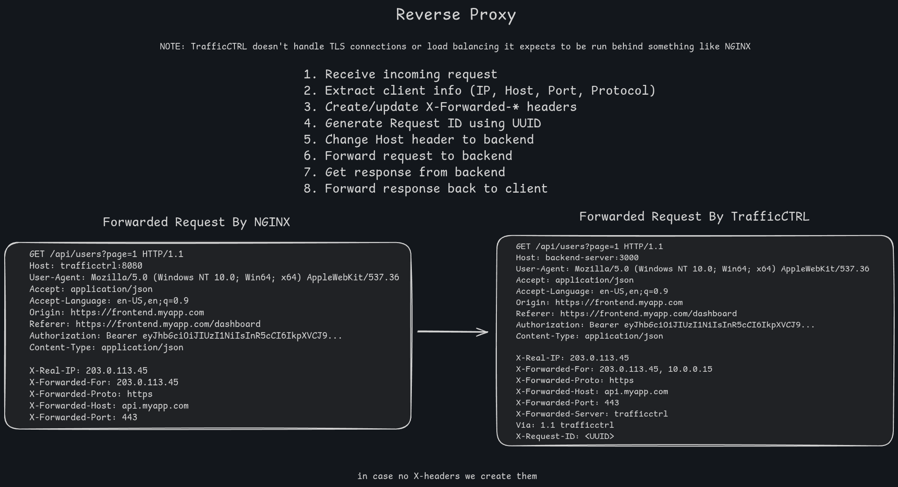

# Proxy Package Documentation

## Overview

The `proxy` package handles HTTP server setup and reverse proxy functionality. It chains all middleware together and forwards requests to the backend service while preserving client information via standard forwarding headers.

---

## Files

### **server.go**

Server initialization and middleware chain orchestration.

**Main Function:**

```go
func StartServer(cfg *config.Config, lgr *logger.Logger, rateLimiter *limiter.RateLimiter) error
```

**What it does:**

1. Creates two HTTP servers:
   - **Proxy server**: Main reverse proxy (port from config, default 8080)
   - **Metrics server**: Prometheus metrics endpoint (port from config, default 8090)
2. Builds the middleware chain (in reverse order, executed bottom-to-top)
3. Starts both servers concurrently
4. If either server fails, shuts down both gracefully

**Middleware Chain (Execution Order):**

```
Request Flow (bottom to top):
1. RecoveryMiddleware       ← Catch panics, prevent crashes
2. MetadataMiddleware        ← Extract request metadata (path, method, IP)
3. ClassifierMiddleware      ← Match request to endpoint rules
4. DryRunMiddleware          ← Log violations without blocking (if enabled)
5. GlobalLimitMiddleware     ← Check system-wide limit + reputation
6. TenantLimitMiddleware     ← Check per-user limit
7. EndpointLimitMiddleware   ← Check per-endpoint limit
8. ReverseProxy              ← Forward to backend if allowed
```

**Why This Order:**

- **Recovery first** (outermost): Catches panics from any middleware
- **Metadata early**: Extract basic info before classification
- **Classifier before limits**: Need to know which endpoint rules apply
- **Dry run before limits**: Can intercept and log without enforcing
- **Global → Tenant → Endpoint**: Broadest to most specific limits
- **Proxy last** (innermost): Only reached if all checks pass

**Server Lifecycle:**

```go
errChan := make(chan error, 2)

// Start proxy server in goroutine
go func() {
    if err := proxyServer.ListenAndServe(); err != nil {
        errChan <- err
    }
}()

// Start metrics server in goroutine
go func() {
    if err := metricsServer.ListenAndServe(); err != nil {
        errChan <- err
    }
}()

// Block until first error from either server
err := <-errChan

// Shutdown both servers gracefully (5 second timeout)
```

**Why Shutdown Both:**
If one server fails, the application is in undefined state. Better to shut down completely and restart via orchestrator (Docker, K8s, systemd).

**Config Propagation:**

```go
ctx := config.WithConfigSnapshot(r.Context(), cfg)
r = r.WithContext(ctx)
```

Attaches config to request context so all middleware can access it.

---

### **proxy.go**



Reverse proxy creation and request header manipulation.

**Main Function:**

```go
func createProxy(cfg *config.Config) (*httputil.ReverseProxy, error)
```

Creates a reverse proxy using Go's `httputil.ReverseProxy` with custom Director function to inject forwarding headers.

**Custom Director:**

```go
proxy.Director = func(req *http.Request) {
    setForwardedHostHeader(req)
    setForwardedPortHeader(req)
    setForwardedProtoHeader(req)
    setForwardedServerHeader(req, cfg.Proxy.ServerName)
    defaultDirector(req)  // Built-in proxy logic
}
```

**Forwarding Headers (Standard X-Forwarded-\* Headers):**

**1. X-Forwarded-Proto**

```go
func setForwardedProtoHeader(req *http.Request)
```

- Preserves the protocol the client originally used
- Currently defaults to `"http"` (TrafficCTRL doesn't terminate TLS)
- If behind a TLS terminator (nginx, ALB), preserves existing header

**2. X-Forwarded-Host**

```go
func setForwardedHostHeader(req *http.Request)
```

- Preserves the original `Host` header from the client
- Backend services can see what hostname the client requested
- Example: Client hits `api.example.com`, backend sees this in `X-Forwarded-Host`

**3. X-Forwarded-Port**

```go
func setForwardedPortHeader(req *http.Request)
```

- Extracts port from client's request
- If no explicit port: defaults to 443 (https) or 80 (http) based on protocol
- Helps backend services generate correct redirect URLs

**4. X-Forwarded-Server**

```go
func setForwardedServerHeader(req *http.Request, serverName string)
```

- Identifies TrafficCTRL as the proxy
- Uses `server_name` from config (e.g., `"trafficctrl:v0.1.0"`)
- Useful for debugging/tracing requests through proxy chain

**Why These Headers Matter:**

When requests pass through proxies, the backend loses original client information:

- Backend sees proxy's IP, not client's IP
- Backend sees proxy's host, not client's host
- Backend can't tell if client used HTTP or HTTPS

Standard `X-Forwarded-*` headers preserve this information so backends can:

- Log real client IPs
- Generate correct absolute URLs
- Enforce HTTPS-only policies
- Handle virtual hosts correctly

**Header Preservation:**
All functions check if header already exists before setting:

```go
if header := req.Header.Get("X-Forwarded-Proto"); header != "" {
    return  // Already set by upstream proxy
}
```

This allows chaining proxies without losing information.

---

## Usage Flow

### Startup Sequence:

1. **main.go** calls `StartServer(cfg, logger, rateLimiter)`
2. **Proxy created** with `createProxy(cfg)` → parses target URL, sets up Director
3. **Root handler built** with middleware chain
4. **Two servers start** concurrently (proxy + metrics)
5. **Application blocks** waiting for errors
6. **On error** → graceful shutdown with 5s timeout

### Per-Request Flow:

1. Client request hits proxy server (port 8080)
2. Root handler injects config into context
3. Middleware chain executes (recovery → metadata → classifier → limits → proxy)
4. If allowed: request forwarded to backend with `X-Forwarded-*` headers
5. Backend response returned to client
6. Metrics recorded throughout chain

### Metrics Endpoint:

- Separate server on port 8090 (isolated from main traffic)
- Exposes `/metrics` endpoint for Prometheus scraping
- Doesn't go through middleware (direct access)

---

## Architecture Decisions

**Two Separate Servers:**

- Metrics isolated from user traffic (no rate limiting on metrics scraping)
- Can expose metrics internally without exposing proxy publicly
- Metrics server failure doesn't affect proxy (until shutdown triggered)

**Middleware as Wrappers:**
Each middleware wraps the next:

```go
var next http.Handler = proxy
next = middleware.EndpointLimitMiddleware(next, rateLimiter)
next = middleware.TenantLimitMiddleware(next, rateLimiter)
// etc...
```

This creates a chain where each middleware can:

- Inspect the request
- Short-circuit (return early without calling next)
- Modify request/response
- Call `next.ServeHTTP()` to continue chain

**Config in Context:**
Avoids passing config through every function. Middleware can retrieve with:

```go
cfg := config.GetConfigFromContext(r.Context())
```

**Graceful Shutdown:**
5-second timeout allows in-flight requests to complete before forced shutdown.

---

## Important Notes

- **No TLS termination**: TrafficCTRL forwards HTTP only. Put it behind a TLS terminator (nginx, Caddy, ALB)
- **Binds to 0.0.0.0**: Listens on all interfaces (Docker-friendly)
- **Concurrent servers**: Both run in goroutines, main thread blocks on error channel
- **Error handling**: First error triggers shutdown of both servers
- **Standard headers**: Uses industry-standard `X-Forwarded-*` headers for compatibility
- **Middleware order matters**: Recovery must be outermost, proxy must be innermost
- **Single-host proxy**: Uses `NewSingleHostReverseProxy` (one backend target only)
